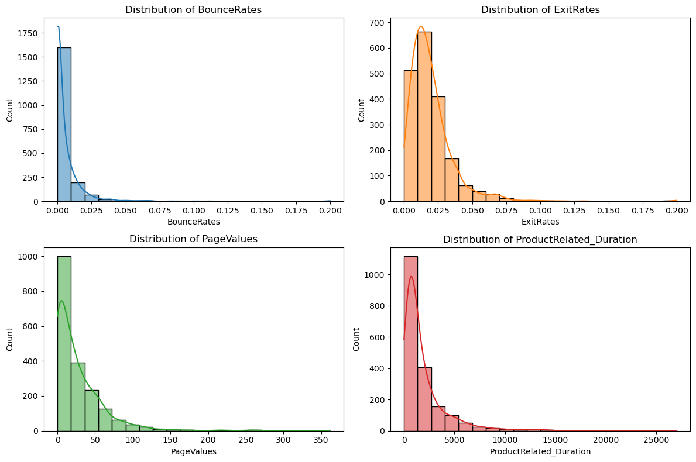

# prog_for_data_analysis

Problem statement:

For this project you must create a data set by simulating a real-world phenomenon of
your choosing. You may pick any phenomenon you wish – you might pick one that is
of interest to you in your personal or professional life. Then, rather than collect data
related to the phenomenon, you should model and synthesise such data using Python.
We suggest you use the numpy.random package for this purpose.

Specifically, in this project you should:
• Choose a real-world phenomenon that can be measured and for which you could
collect at least one-hundred data points across at least four different variables.
• Investigate the types of variables involved, their likely distributions, and their
relationships with each other.
• Synthesise/simulate a data set as closely matching their properties as possible.
• Detail your research and implement the simulation in a Jupyter notebook – the
data set itself can simply be displayed in an output cell within the notebook.

Note that this project is about simulation – you must synthesise a data set. Some
students may already have some real-world data sets in their own files. It is okay to
base your synthesised data set on these should you wish (please reference it if you do),
but the main task in this project is to create a synthesised data set. The next section
gives an example project idea.
 
________________________________

1. Choose a real-world phenomenon that can be measured and for which you could collect at least one-hundred data points across at least four different variables.

Simulating a data set based on the Online Shoppers Purchasing Intention Dataset from UCI Machine Learning Repository
 [*link: https://archive.ics.uci.edu/dataset/468/online+shoppers+purchasing+intention+dataset*]

 # Online Shoppers Purchasing Intention Dataset

## Overview

The Online Shoppers Purchasing Intention Dataset is a collection of data related to online shopping behavior and purchasing intention. This dataset was compiled with the goal of understanding and analyzing the factors that influence whether a visitor to an online shopping website will make a purchase or not.

## Source

The dataset is sourced from the UCI Machine Learning Repository and is publicly available at the following link: [Online Shoppers Purchasing Intention Dataset](https://archive.ics.uci.edu/dataset/468/online+shoppers+purchasing+intention+dataset).

## Dataset Information

### Variables

1. **Administrative, Administrative_Duration:**
   - These variables capture the number of administrative pages visited and the total duration spent on administrative pages.

2. **Informational, Informational_Duration:**
   - Similar to administrative variables, these capture the number of informational pages visited and the total duration spent on them.

3. **ProductRelated, ProductRelated_Duration:**
   - These variables relate to product-related pages, counting the number of pages visited and the total duration spent.

4. **BounceRates:**
   - The percentage of visitors who enter the website and then leave ("bounce") without interacting further.

5. **ExitRates:**
   - The percentage of pageviews that ended with the particular page.

6. **PageValues:**
   - The average value of the page, representing how much a page is worth in terms of revenue.

7. **SpecialDay:**
   - A variable indicating the closeness of the site visit to a special day (e.g., Mother's Day, Valentine's Day).

8. **Month, OperatingSystems, Browser, Region, TrafficType:**
   - Categorical variables indicating the month of the visit, operating system, browser used, visitor's region, and the type of traffic.

9. **VisitorType:**
   - Categorizes visitors as 'New Visitor,' 'Returning Visitor,' or 'Other.'

10. **Weekend:**
    - Binary variable indicating whether the visit occurred on the weekend.

11. **Revenue:**
    - The target variable indicating whether a purchase was made (True) or not (False).

[1] information citated from https://archive.ics.uci.edu/dataset/468/online+shoppers+purchasing+intention+dataset.

2. Investigate the types of variables involved, their likely distributions, and their
relationships with each other.

# Chosen Variables Overview

This section provides an overview of four chosen variables from the Online Shoppers Purchasing Intention Dataset, along with conclusions drawn from previous research and visualizations.

## Chosen Variables

### BounceRates
The `BounceRates` variable represents the percentage of visitors who enter the site and "bounce" (leave the site) rather than continuing to view other pages within the same site. High bounce rates may indicate that visitors are not finding the content engaging or relevant.

### ExitRates
The `ExitRates` variable indicates the percentage of visitors who exit the site from a particular page after visiting it. This metric helps identify pages with a high exit rate, potentially signaling areas of the site where visitors commonly leave.

### PageValues
`PageValues` represents the average value of the page averaged over the session. This metric provides insights into the overall value generated by pages during a visitor's session. Higher `PageValues` may indicate that visitors who view the page are more likely to make a purchase.

### ProductRelated_Duration
The `ProductRelated_Duration` variable measures the total time spent by the visitor on product-related pages during the session. This duration can provide information about the level of engagement with product-related content and may influence purchasing decisions.

## Conclusions

Based on previous research and visualizations conducted using Seaborn and Matplotlib, the following conclusions was drawn about the distributions of these chosen variables:

1. **BounceRates:**
   - The distribution of `BounceRates` appears to be right-skewed, with a majority of visitors having lower bounce rates. Some outliers may indicate a small percentage of sessions with exceptionally high bounce rates.

2. **ExitRates:**
   - The distribution of `ExitRates` is right-skewed, suggesting that most pages have a low exit rate. Certain pages, indicated by outliers, may experience a higher exit rate, requiring further investigation.

3. **PageValues:**
   - The distribution of `PageValues` is positively skewed, with a concentration of sessions having lower average page values. This aligns with expectations, as not all pages may contribute equally to revenue.

4. **ProductRelated_Duration:**
   - The distribution of `ProductRelated_Duration` is right-skewed, indicating that the majority of sessions have relatively shorter durations on product-related pages. Some sessions, however, exhibit longer durations, suggesting deeper engagement.

These conclusions provide insights into the behavior of visitors on the online shopping website and can guide furthe analysis and decision-making in optimizing the user experience and enhancing purchase intent.

# **Data Simulation Summary**

This project focuses on simulating a dataset to replicate real-world phenomena related to online shopping behavior. The analysis involves key variables, including BounceRates, ExitRates, PageValues, and ProductRelated_Duration, extracted from the Online Shoppers Purchasing Intention Dataset.

## Analysis of Variables

The Seaborn and Matplotlib libraries were employed in a Jupyter notebook to analyze the distributions and relationships among the chosen variables. Insights gained from this analysis informed the subsequent simulation process.

## Simulation Strategy

The simulation code, implemented using the numpy.random package, aimed to generate data that closely mirrors the statistical properties of the original dataset. 

Unfortunately, fitter package do not installed correctly, so I used my basic knowledge of distributions to find the best looking model. 

## Simulated Data Results

The results of the simulation are presented in a DataFrame named `simulated_df2`. A careful examination of the simulated data reveals that the distributions of the variables closely resemble those observed in the original dataset. The use of left-skewed and exponential distributions successfully captures the statistical characteristics of online shopping behavior.

## Implications and Usage

The synthesized dataset serves as a robust foundation for further analyses, allowing researchers and analysts to explore and test hypotheses in scenarios where collecting real-world data may be challenging or time-consuming. The code and simulated dataset provided in this project offer a valuable resource for those interested in understanding and studying online shopper behavior.

-----------------------
*'This project is about simulation – you must synthesise a data set.' from problem statement*

##  Data simulation general information 

Knowledge of data synthesis is a valuable skill for data analysts for several reasons:

Missing or Limited Real Data: In some situations, obtaining real-world data may be challenging due to privacy concerns, data availability, or other constraints. Data synthesis allows analysts to generate artificial datasets that mimic real-world scenarios, enabling them to perform analyses and develop models.

Scenario Testing: Data analysts often need to assess how well models or algorithms perform under different conditions. Synthetic data provides a controlled environment for testing without relying on scarce or sensitive real-world data.

Model Validation: Analysts can use synthesized data to validate and fine-tune models. This helps in understanding how well a model generalizes to different scenarios and whether adjustments are needed.